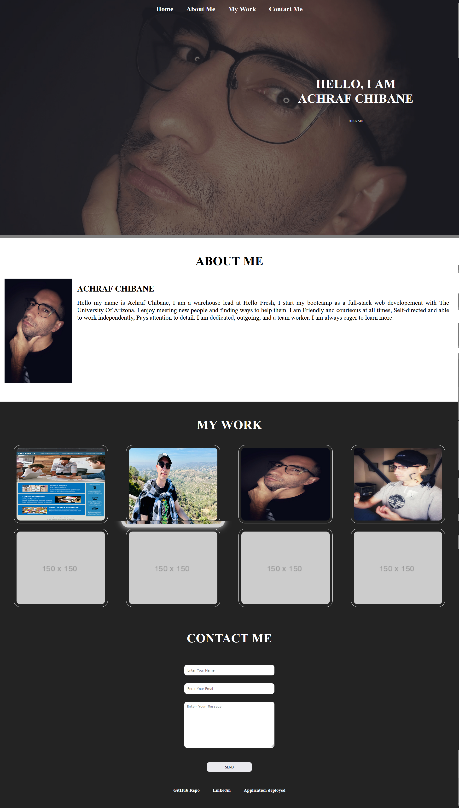

<h1> Create a Portfolio</h1>
Bootcamp challenge 02 build a portfolio page from scratch, which we can add to as the course progresses.

<h2>The challange </h2>
you'll create a web application from scratch, you'll build a portfolio page, which you can add to as the course progresses.

## User Story
<ul>
<li>AS AN employer  </li>
<li>I WANT to view a potential employee's deployed portfolio of work samples </li>
<li>SO THAT I can review samples of their work and assess whether they're a good candidate for an open position</li>
</ul>

## Acceptance Criteria
<ul>
<li>GIVEN I need to sample a potential employee's previous work </li>
<li>WHEN I load their portfolio </li>
<li>THEN I am presented with the developer's name, a recent photo or avatar, and links to sections about them, their work, and how to contact them </li>
<li>WHEN I click one of the links in the navigation </li>
<li>THEN the UI scrolls to the corresponding section </li>
<li>WHEN I click on the link to the section about their work </li>
<li>THEN the UI scrolls to a section with titled images of the developer's applications </li>
<li>WHEN I am presented with the developer's first application </li>
<li>THEN that application's image should be larger in size than the others </li>
<li>WHEN I click on the images of the applications </li>
<li>THEN I am taken to that deployed application </li>
<li>WHEN I resize the page or view the site on various screens and devices </li>
<li>THEN I am presented with a responsive layout that adapts to my viewport </li>
</ul>

## Screenshot
 

## Links to the challange
 
The challange was upload to Github at the following repository: 
GitHub Repo(https://github.com/Ash0422/my-portfolio) 
 
deployed application: (https://ash0422.github.io/my-portfolio/)

## Resources
 
<ul>
<li>https://developer.mozilla.org/en-US/ </li>
<li>https://devdocs.io/ </li>
<li>https://colorhunt.co/palettes/cold </li>
<li>https://www.w3schools.com/ </li>

